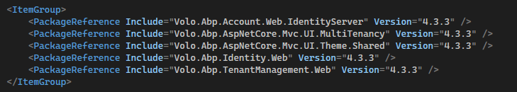

# Using the AdminLTE Theme with the ABP Framework MVC / Razor Pages UI

This article shows step by step how to use the AdminLTE Theme for ABP Framework MVC / Razor Page UI applications.

First, let's install the ABP CLI tool using the command below.

````shell
dotnet tool install -g Volo.Abp.Cli
````

If it's already installed, you can update it with the following command:

````shell
dotnet tool update -g Volo.Abp.Cli
````

Let's create a sample new project to apply the theme:

````shell
abp new AbpThemeAdminLteSample
````

Let's create a **theme** folder for the theme project in the project main directory and go to the **theme** directory on the command line:

````shell
mkdir theme
cd theme
````

Let's get the **AdminLTE** theme module project for ABP via git:

````shell
git clone https://github.com/mucahiddanis/Abp.AspNetCore.Mvc.UI.Theme.AdminLTE.git
````

Go back to the project main directory:

````shell
cd ..
cd ..
````

Let's add the AdminLTE theme project to the **sln** file:

````shell
dotnet sln add theme/Abp.AspNetCore.Mvc.UI.Theme.AdminLTE/Abp.AspNetCore.Mvc.UI.Theme.AdminLTE.csproj
````

Let's reference the AdminLTE theme project in our `AbpThemeAdminLteSample.Web` project:

````shell
<ProjectReference Include="..\..\theme\Abp.AspNetCore.Mvc.UI.Theme.AdminLTE\Abp.AspNetCore.Mvc.UI.Theme.AdminLTE.csproj" />
````

Configure our theme in the `AbpThemeAdminLteSample.Web.AbpThemeAdminLteSampleWebModule.cs` web module:

````csharp
[DependsOn(
        typeof(AbpThemeAdminLteSampleHttpApiModule),
        typeof(AbpThemeAdminLteSampleApplicationModule),
        typeof(AbpThemeAdminLteSampleEntityFrameworkCoreDbMigrationsModule),
        typeof(AbpAutofacModule),
        typeof(AbpIdentityWebModule),
        typeof(AbpAccountWebIdentityServerModule),
        typeof(AbpAspNetCoreMvcUiBasicThemeModule),
        typeof(AbpAspNetCoreAuthenticationJwtBearerModule),
        typeof(AbpTenantManagementWebModule),
        typeof(AbpAspNetCoreSerilogModule)
        )]
    public class AbpThemeAdminLteSampleWebModule : AbpModule
````


````csharp
typeof(AbpAspNetCoreMvcUiBasicThemeModule),
````

Let's replace the code above with following code below :

````csharp
typeof(AbpAspNetCoreMvcUiAdminLTEThemeModule),
````

Add **using** to reference theme project

````csharp
using Abp.AspNetCore.Mvc.UI.Theme.AdminLTE;
````

The **DependsOn** list should finally be:

````csharp
[DependsOn(
        typeof(AbpThemeAdminLteSampleHttpApiModule),
        typeof(AbpThemeAdminLteSampleApplicationModule),
        typeof(AbpThemeAdminLteSampleEntityFrameworkCoreDbMigrationsModule),
        typeof(AbpAutofacModule),
        typeof(AbpIdentityWebModule),
        typeof(AbpAccountWebIdentityServerModule),
        typeof(AbpAspNetCoreMvcUiAdminLTEThemeModule),
        typeof(AbpAspNetCoreAuthenticationJwtBearerModule),
        typeof(AbpTenantManagementWebModule),
        typeof(AbpAspNetCoreSerilogModule)
        )]
    public class AbpThemeAdminLteSampleWebModule : AbpModule
````

Let's **Build** the project.

Let's run the `AbpThemeAdminLteSample.DbMigrator` and `AbpThemeAdminLteSample.Web` project.


**Version Update**

Active version

> ABP v3.2.1

You just need to update the versions of ABP packages in the theme project file `Abp.AspNetCore.Mvc.UI.Theme.AdminLTE.csproj`.


