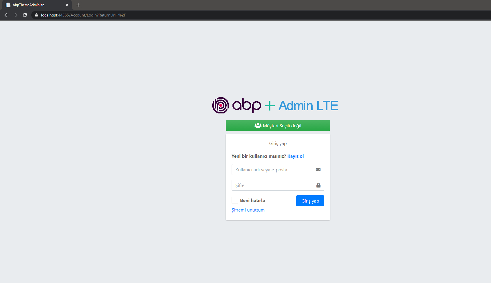
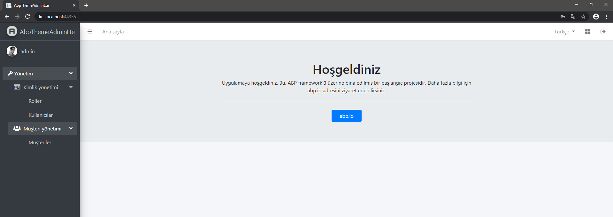
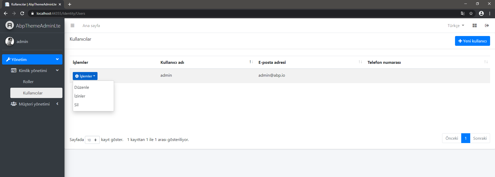
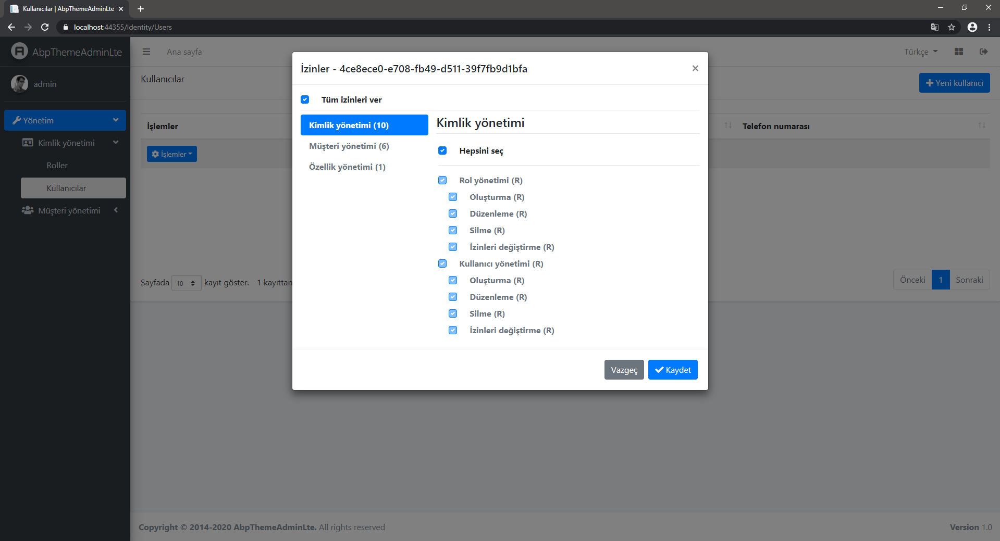
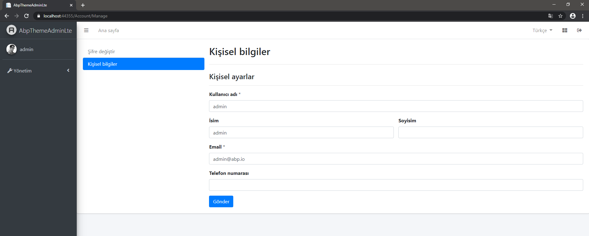
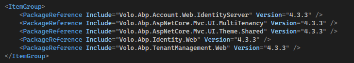

# Abp.AspNetCore.Mvc.UI.Theme.AdminLTE
ABP framework AdminLTE Theme


ABP framework ile geliştirilen AspNet MVC / Razor projeleri için AdminLTE temasıdır.

Öncelikle ABP CLI aracını aşağıdaki komutu kullanarak kuralım.

````shell
dotnet tool install -g Volo.Abp.Cli
````

Zaten yüklüyse aşağıdaki komutla güncelleyebilirsiniz:

````shell
dotnet tool update -g Volo.Abp.Cli
````

Temayı uygulamak için örnek yeni bir proje oluşturalım:

````shell
abp new AbpThemeAdminLte
````

Proje ana dizininde Tema projesi için **theme** isminde klasör oluşturalım ve komut satırında **theme** dizinine gidelim:

````shell
mkdir theme
cd theme
````

ABP için **AdminLTE** tema modülü projesini git üzerinden alalım:

````shell
git clone https://github.com/mucahiddanis/Abp.AspNetCore.Mvc.UI.Theme.AdminLTE.git
````

Proje ana dizinine dönelim:

````shell
cd ..
cd ..
````

**sln** dosyasına AdminLTE tema projesini ekleyelim:

````shell
dotnet sln add theme/Abp.AspNetCore.Mvc.UI.Theme.AdminLTE/Abp.AspNetCore.Mvc.UI.Theme.AdminLTE.csproj
````

`AbpThemeAdminLte.Web` projemize AdminLTE tema projesini referans edelim:

````shell
<ProjectReference Include="..\..\theme\Abp.AspNetCore.Mvc.UI.Theme.AdminLTE\Abp.AspNetCore.Mvc.UI.Theme.AdminLTE.csproj" />
````

`AbpThemeAdminLte.Web.AbpThemeAdminLteWebModule.cs` web modülünde temamızı konfigüre edelim:

````csharp
[DependsOn(
        typeof(AbpThemeAdminLteHttpApiModule),
        typeof(AbpThemeAdminLteApplicationModule),
        typeof(AbpThemeAdminLteEntityFrameworkCoreDbMigrationsModule),
        typeof(AbpAutofacModule),
        typeof(AbpIdentityWebModule),
        typeof(AbpAccountWebIdentityServerModule),
        typeof(AbpAspNetCoreMvcUiBasicThemeModule),
        typeof(AbpAspNetCoreAuthenticationJwtBearerModule),
        typeof(AbpTenantManagementWebModule),
        typeof(AbpAspNetCoreSerilogModule)
        )]
    public class AbpThemeAdminLteWebModule : AbpModule
````


````csharp
typeof(AbpAspNetCoreMvcUiBasicThemeModule),
````

Yukarıdaki kodun altına aşağıdaki kodu ekleyelim:

````csharp
typeof(AbpAspNetCoreMvcUiAdminLTEThemeModule),
````

modülün çözümlenmesi için **using** ekleyelim:

````csharp
using Abp.AspNetCore.Mvc.UI.Theme.AdminLTE;
````

**DependsOn** listesi son olarak şöyle olmalı:

````csharp
[DependsOn(
        typeof(AbpThemeAdminLteHttpApiModule),
        typeof(AbpThemeAdminLteApplicationModule),
        typeof(AbpThemeAdminLteEntityFrameworkCoreDbMigrationsModule),
        typeof(AbpAutofacModule),
        typeof(AbpIdentityWebModule),
        typeof(AbpAccountWebIdentityServerModule),
        typeof(AbpAspNetCoreMvcUiBasicThemeModule),
        typeof(AbpAspNetCoreMvcUiAdminLTEThemeModule),
        typeof(AbpAspNetCoreAuthenticationJwtBearerModule),
        typeof(AbpTenantManagementWebModule),
        typeof(AbpAspNetCoreSerilogModule)
        )]
    public class AbpThemeAdminLteWebModule : AbpModule
````

AdminLTE temasının css, js, image gibi kaynak dosyaları için **VirtualFileSystem** ayarını yapalım. Bunun için `AbpThemeAdminLte.Web.AbpThemeAdminLteWebModule.cs` dosyasında
`ConfigureVirtualFileSystem` methoduna ekleme yapalım:

````chasrp
private void ConfigureVirtualFileSystem(IWebHostEnvironment hostingEnvironment)
        {
            if (hostingEnvironment.IsDevelopment())
            {
                Configure<AbpVirtualFileSystemOptions>(options =>
                {
                    options.FileSets.ReplaceEmbeddedByPhysical<AbpThemeAdminLteDomainSharedModule>(Path.Combine(hostingEnvironment.ContentRootPath, $"..{Path.DirectorySeparatorChar}AbpThemeAdminLte.Domain.Shared"));
                    options.FileSets.ReplaceEmbeddedByPhysical<AbpThemeAdminLteDomainModule>(Path.Combine(hostingEnvironment.ContentRootPath, $"..{Path.DirectorySeparatorChar}AbpThemeAdminLte.Domain"));
                    options.FileSets.ReplaceEmbeddedByPhysical<AbpThemeAdminLteApplicationContractsModule>(Path.Combine(hostingEnvironment.ContentRootPath, $"..{Path.DirectorySeparatorChar}AbpThemeAdminLte.Application.Contracts"));
                    options.FileSets.ReplaceEmbeddedByPhysical<AbpThemeAdminLteApplicationModule>(Path.Combine(hostingEnvironment.ContentRootPath, $"..{Path.DirectorySeparatorChar}AbpThemeAdminLte.Application"));
                    options.FileSets.ReplaceEmbeddedByPhysical<AbpThemeAdminLteWebModule>(hostingEnvironment.ContentRootPath);

                    // AdminLTE teması
                    options.FileSets.ReplaceEmbeddedByPhysical<AbpThemeAdminLteApplicationModule>(Path.Combine(hostingEnvironment.ContentRootPath, $"..{Path.DirectorySeparatorChar}..{Path.DirectorySeparatorChar}Abp.AspNetCore.Mvc.UI.Theme.AdminLTE"));
                });
            }
        }
````

Projeyi **Build** edelim.

`AbpThemeAdminLte.DbMigrator` projesini çalıştıralım.
`AbpThemeAdminLte.Web` Projesini çalıştıralım.












**Versiyon Güncelleme**

Aktif versiyon

> ABP v3.2.0

`Abp.AspNetCore.Mvc.UI.Theme.AdminLTE.csproj` tema proje dosyasında ABP paketlerinin versiyonlarını güncellemeniz yeterli.

